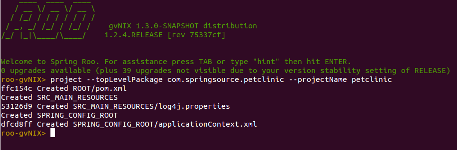
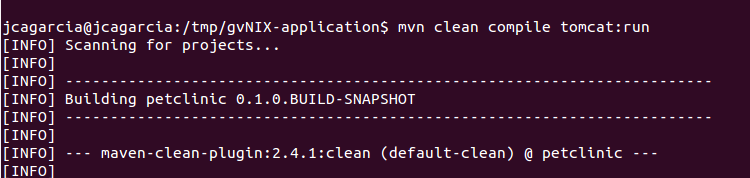
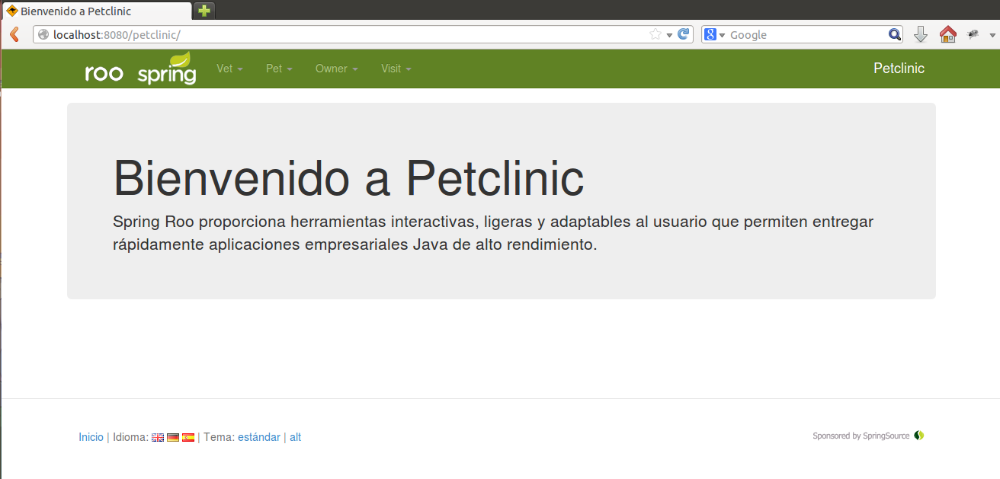

= gvNIX quick start application
Getting started with gvNIX
:page-layout: base
:toc-placement: manual
:homepage: http://gvnix.org
:download: http://code.google.com/p/gvnix/
:installguide: http://code.google.com/p/gvnix/wiki/InstallGvnix
:download: http://code.google.com/p/gvnix/downloads/

gvNIX is a Spring Roo distribution that focuses both enterprise knowledge and 
enterprise standards to build Java applications.

You must {download}[download], unpack and {installguide}[install] the 
development environment for gvNIX 1.3+, to be able to follow this guide.

The goal of this quick start guide is to familiarize you with gvNIX. For this 
purpose, we will build an application following a _domain-driven design_
philosophy:

* Start with domain model (entities and logic) that captures the problem domain
  of the system being built.
* Start without a service layer initially and only add services where the 
  logic doesn't belong in any domain entity.
* Use _Design by Contract_ (DbC), _Automated Tests_, _CI_ and _Refactoring_ to 
  make the implementation as closely aligned as possible with the domain model.

The application presented in this guide is the Spring PetClinic application. The users of the application are employees of the clinic who, in the course of their work, need to view and manage information regarding veterinarians, the clients, and their pets.

Note this sample isn't a real application which normally needs additional work
like UI customization, performance improvement, database queries tunning, etc.

== Guide

You can execute https://github.com/DISID/gvnix-samples/blob/master/quickstart-app/quickstart.roo[quickstart.roo] file and creates a petclinic example application. 

If you don't have experience using gvNIX, you can follow the next Guide to generate a petclinic example application.

This guide teaches you how to:

. <<create-a-new-project, Create a new project>>
. <<persistence-setup, Persistence Setup>>
. <<build-the-domain-model, Build the domain model>>
. <<add-finder-methods, Add finder methods>>
. <<add-web-layers, Add web layers>>
. <<jquery-datatables-and-bootstrap-setup, JQuery Datatables and Bootstrap Setup >>
. <<create-patterns-and-details-using-datatables, Create Patterns & Details using Datatables>>
. <<run-application, Run application >>
. <<enable-datatables-inline-editing, Enable Datatables Inline Editing >>
. <<menu-setup, Menu Setup >>
. <<add-spring-security, Add Spring Security >>
. <<add-reports, Add Reports >>
. <<add-optimistic-concurrency-control, Add Optimistic Concurrency Control >>
. <<add-junit-and-selenium-tests, Add JUnit and Selenium Tests >>
. <<add-webservices, Add WebServices >>

[[create-a-new-project]]
== Create a new project

. Create a directory for the new project.
+

[source,shell]
$ mkdir clinic
$ cd clinic

. Start gvNIX
. Execute command to create project:
+

[source,shell]
project --topLevelPackage com.springsource.petclinic --projectName petclinic

[[persistence-setup]]
== Persistence Setup

Execute the following command to set up persistence in your gvNIX project:

[source,shell]
jpa setup --provider HIBERNATE --database HYPERSONIC_PERSISTENT

[icon="images/icons/note.png"]
NOTE: _You can replace *provider* param and *database* param with your own configuration._

[[build-the-domain-model]]
== Build the domain model

=== The domain model

image:images/petclinic-uml.png[Pet Clinic Domain Entities]

This class diagram represents a simplified model of the problem domain for the
pet clinic problem domain, it is a good starting point for the application 
in order to deliver a first prototype.

=== Create the domain entities

Following the above class diagram, run the next commands to generate the petclinic domain entities:

. Create entities:
+

[source,shell]
entity jpa --class ~.domain.Pet --sequenceName PET_SEQ
entity jpa --class ~.domain.Visit --sequenceName VISIT_SEQ
entity jpa --class ~.domain.AbstractPerson --abstract
entity jpa --class ~.domain.Vet --extends ~.domain.AbstractPerson
entity jpa --class ~.domain.Owner --extends ~.domain.AbstractPerson

. Create *PetType* and *Specialty* enumerates to use in petclinic application:
+

[source,shell]
enum type --class ~.reference.PetType
enum constant --name Dog
enum constant --name Cat
enum constant --name Bird
enum type --class ~.reference.Specialty
enum constant --name Cardiology
enum constant --name Dentistry
enum constant --name Nutrition

. Add fields to entities:
+

[source,shell]
field string --fieldName firstName --sizeMin 3 --sizeMax 30 --class ~.domain.AbstractPerson
field string --fieldName lastName --notNull --sizeMin 3 --sizeMax 30
field string --fieldName address --notNull --sizeMax 50 --sizeMin 1
field string --fieldName city --notNull --sizeMax 30
field string --fieldName telephone --notNull
field string --fieldName homePage --sizeMax 30
field string --fieldName email --sizeMax 30 --sizeMin 6
field date --fieldName birthDay --type java.util.Date --notNull
field string --fieldName description --sizeMax 255 --class ~.domain.Visit
field date --fieldName visitDate --type java.util.Date --notNull --past
field reference --fieldName pet --type ~.domain.Pet --notNull
field reference --fieldName vet --type ~.domain.Vet
field boolean --fieldName sendReminders --notNull --primitive --class ~.domain.Pet
field string --fieldName name --notNull --sizeMin 1
field number --fieldName weight --type java.lang.Float --notNull --min 0
field reference --fieldName owner --type ~.domain.Owner
field enum --fieldName type --type ~.reference.PetType --notNull
field date --fieldName employedSince --type java.util.Calendar --notNull --past --class ~.domain.Vet
field enum --fieldName specialty --type ~.reference.Specialty --notNull false
field set --class ~.domain.Owner --fieldName pets --type ~.domain.Pet --mappedBy owner --notNull false --cardinality ONE_TO_MANY
field set --class ~.domain.Vet --fieldName visits --type ~.domain.Visit --mappedBy vet --notNull false --cardinality ONE_TO_MANY
field reference --fieldName owner --type ~.domain.Owner --class ~.domain.Vet
field set --fieldName vets --type ~.domain.Vet --class ~.domain.Owner --cardinality ONE_TO_MANY --mappedBy owner
field set --fieldName visits --type ~.domain.Visit --class ~.domain.Pet --cardinality ONE_TO_MANY --mappedBy pet

+

[icon="images/icons/note.png"]
NOTE: _You must to indicate *field type*, *field name* and the *entity class*._

[[add-finder-methods]]
== Add finder methods

If you want to *find data* by different fields, you need to generate some methods. Execute the following commands in gvNIX shell to implements this functionality:

[source,shell]
finder add --finderName findPetsByNameAndWeight --class ~.domain.Pet
finder add --finderName findPetsByOwner
finder add --finderName findPetsBySendRemindersAndWeightLessThan
finder add --finderName findPetsByTypeAndNameLike
finder add --finderName findVisitsByDescriptionAndVisitDate --class ~.domain.Visit
finder add --finderName findVisitsByVisitDateBetween
finder add --finderName findVisitsByDescriptionLike

[icon="images/icons/note.png"]
NOTE: _You must to indicate *unic finderName* and entity class._

[[add-web-layers]]
== Add Web Layers

. Execute the following commands setup web layer: and generate web layer:
+

[source,shell]
web mvc setup

. Execute the following commands to generate web layer for all application entities:
+

[source,shell]
web mvc all --package ~.web

. To generate web layers of all the generated finders above, run the next commands:
+

[source,shell]
web mvc finder all

. *(Optional)* If you want to install some *differents languages* to use in your application, execute de following commands:
+

[source,shell]
web mvc language --code es
web mvc language --code de

[[jquery-datatables-and-bootstrap-setup]]
== JQuery, Datatables & Bootstrap Setup

=== JQuery

Spring MVC - jQuery integration.

    * Converts Dojo based views into jQuery based views
    * Adds form validation support
    * Reduces the contents of small JavaScript code into the HTML document
    * Includes jQuery UI 

Looks how easy you can transform your Dojo based project into jQuery based project: 

. To use jQuery components in your project, you must to execute the following command:
+

[source,shell]
web mvc jquery setup

. Configure all your views to use jQuery components running the next command:
+

[source,shell]
web mvc jquery all

. Optionally, you can convert view-by-view to jQuery
+

[source,shell]
web mvc jquery add --type ~.web.PetController

=== Datatables

To use Datatables to show data in your application, execute the following command:

[source,shell]
web mvc datatables setup 

=== Bootstrap

Implements Bootstrap in your application to modify its visual appearance executing the next command:

[source,shell]
web mvc bootstrap setup

[[create-patterns-and-details-using-datatables]] 
== Create Patterns and Details using Datatables

=== Create master patterns 

After setup Datatables components run the following commands to create master patterns with Datatable components:

[source,shell]
web mvc datatables add --type ~.web.VetController --mode show
web mvc datatables add --type ~.web.PetController
web mvc datatables add --type ~.web.OwnerController
web mvc datatables add --type ~.web.VisitController

[icon="images/icons/note.png"]
NOTE: _Use *--mode* param with show value, to display only a record per page_

=== Adding Datatables Details

After create Datatables master patterns, you can add details to display related information about the selected row.

. To create the following structure "Master table Owner > detail table Pet" use the next command:
+

[source,shell]
web mvc datatables detail add --type ~.web.OwnerController --property pets

. To create the following structure "Master table Owner > detail table Vet" use the next command:
+

[source,shell]
web mvc datatables detail add --type ~.web.OwnerController --property vets

+

[icon="images/icons/note.png"]
NOTE: _Master Datatable *Vet* uses mode show to display data, so this detail displays a datatable with show mode._

. To create the following structure "Master table Owner > detail table Pet > detail table Visit" use the next command:
+

[source,shell]
web mvc datatables detail add --type ~.web.PetController --property visits

+

[icon="images/icons/note.png"]
NOTE: _The above example, shows three levels of details (Master, detail and detail of the detail)_

. To create the following structure "Master table Owner > detail table Vet > detail table Visit" use the next command:
+

[source,shell]
web mvc datatables detail add --type ~.web.VetController --property visits

[[run-application]]
== Run application

At this point, you can run your generated gvNIX application. To do it:

. Open shell on the main folder of your project.
. Use the following commands to execute your application on tomcat server:
+

[source,shell]
mvn clean compile tomcat:run

At this moment, you can access to your gvNIX application at _http://localhost:8080/petclinic/_

[[enable-datatables-inline-editing]] 
== Enable Datatables Inline Editing

To use InlineEditing Datatables functionalities, you must to generate ajax methods. You can generate them using the following commands.

. Generate batch methods to entities
+

[source,shell]
jpa gvnix setup
jpa batch all

. Generate batch methods to controllers
+
[source,shell]
web mvc batch setup
web mvc batch all

[[menu-setup]]
== Menu Setup

To install gvNIX menu, use the following command:

[source,shell]
menu setup

[[add-spring-security]]
== Add Spring Security

To set up Spring Security in your gvNIX project, use the next command:

[source,shell]
security setup

[icon="images/icons/note.png"]
NOTE: _You need to execute *web mvc bootstrap update* command after security setup to displays login as Bootstrap appearance._

[[add-reports]]
== Add Reports

If you need to print reports of your application data, you can add simple reports using the next commands:

[source,shell]
web report setup
web report add --controller ~.web.OwnerController --reportName report_owners

[[add-optimistic-concurrency-control]]
== Add Optimistic Concurrency Control

To add concurrency control to all entities in your project, use the following command:

[source,shell]
occ checksum all

[[add-junit-and-selenium-tests]] 
== Add JUnit and Selenium Tests

=== JUnit

Add JUnit tests to your application entities using the next commands:

[source,shell]
test integration --entity ~.domain.Vet
test integration --entity ~.domain.Owner
test integration --entity ~.domain.Pet
test integration --entity ~.domain.Visit

=== Selenium

Add Selenium tests to your application entities using the next commands:

[source,shell]
selenium test --controller ~.web.OwnerController
selenium test --controller ~.web.PetController
selenium test --controller ~.web.VetController
selenium test --controller ~.web.VisitController

[[add-webservices]] 
== Add WebServices

gvNIX provides web services that can be accessed by external applications. To implements this functionalities, use the following commands:

[source,shell]
remote service define ws --class ~.services.PetsServices --serviceName ws_get_all_pets
remote service operation --name ws_list_pets --service ~.services.PetsServices

