= gvNIX quick start GEO application
Getting started with gvNIX
:page-layout: base
:toc-placement: manual
:homepage: http://gvnix.org
:download: http://sourceforge.net/projects/gvnix/
:installguide: https://github.com/DISID/gvnix-samples/blob/master/INSTALL-gvNIX-1.x.adoc
:download: http://sourceforge.net/projects/gvnix/

gvNIX is a Spring Roo distribution that focuses both enterprise knowledge and 
enterprise standards to build Java applications.

If you don't know _What is gvNIX?_ you should start with https://github.com/DISID/gvnix-samples/tree/master/quickstart-app[quickstart-app] tutorial.

You must {download}[download], unpack and {installguide}[install] the 
development environment for gvNIX 1.4+, to be able to follow this guide.

The goal of this quick start geo app guide is to familiarize you with GEO apps generated using gvNIX. For this 
purpose, we will build an application based on https://github.com/DISID/gvnix-samples/tree/master/quickstart-app[quickstart-app] tutorial.

You can see an example of a *generated GEO web application* using gvNIX
http://geo-gvnix.rhcloud.com/login[here] (*user*: admin | *pass*: admin)

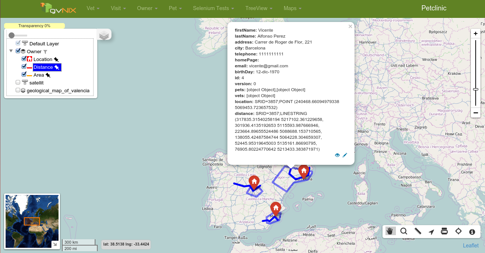

gvNIX uses http://www.leafletjs.com[Leaflet project] to generate map views. 

== Run from Git

If you want to preview this GEO sample application, follow this steps on the following order. If you prefer to develop by your own, go to https://github.com/DISID/gvnix-samples/tree/master/quickstart-geo-app#build-your-own-geo-app[gvNIX GEO Guide]

- Install http://www.postgresql.org/[PostgreSql] and http://postgis.net/[PostGIS]
- Create new Database with name _postgis_example_. Use _gvnix_ as username and _gvnix_ as password.
- Add Postgis extensions on generated DB:

image:images/postgis_db.png[width="30%"]

- Clone github repository
[source, shell]
$ git clone https://github.com/DISID/gvnix-samples.git

- Acces to quickstart-geo-app
[source, shell]
$ cd quickstart-geo-app

- Execute application using maven:
[source, shell]
$ mvn clean compile tomcat:run

- Open your browser on http://localhost:8080/petclinic/
- Access using _admin_ as username and _admin_ as password.

== Build your own geo app 	
 	
You can execute https://github.com/DISID/gvnix-samples/blob/master/quickstart-geo-app/quickstart-geo.roo[quickstart-geo.roo] file and creates a petclinic example application with GEO components. 	
 	
If you don't have experience using gvNIX, you can follow https://github.com/DISID/gvnix-samples/tree/master/quickstart-app#build-your-own-app[quickstart-app guide] and then follow this to generate additional GEO components and functionalities. 	
 	
This guide teaches you how to: 	
 	
. <<configure-persistence, Configure Persistence>> 	
. <<add-spatial-support, Add Spatial Support>> 	
. <<add-geo-entity-fields, Add Geo Entity Fields>> 	
. <<generate-geo-entity-finders, Generate Geo Entity Finders>> 	
. <<use-map-control-on-cru, Use Map Control on CRU>> 	
. <<generate-map-views, Generate Map Views>> 	
. <<add-entities-to-map-views, Add entities to Map Views>> 	
. <<add-base-layers-to-map-views, Add Base Layers to Map Views>> 	
. <<add-tools-to-map-views, Add Tools to Map Views>> 	
. <<advanced-functionalities, Advanced Functionalities>> 	
** <<filtering-map-data-using-datatables, Filtering Map Data using Datatables>> 	
** <<select-map-data-using-datatables, Select Map Data using Datatables>> 	
** <<group-map-markers, Group Map Markers>> 	
 	
[[configure-persistence]] 	
== Configure Persistence 	
	
All DataBases are not valid to use Spatial Operations. 	
 	
That's why we need to configure our project with some valid Spatial DB. We can choose one of the following: 	
 	
- http://www.postgresql.org/[PostgreSql] 	
- http://www.oracle.com/us/products/database/overview/index.html[Oracle 10g/11g] 	
- http://www.mysql.com/[MySQL] 	
- http://www.microsoft.com/es-es/server-cloud/products/sql-server/[SqlServer] 	 	
 	
To follow this guide, you should configure a POSTGRES database on your system and add POSTGIS functionalities. To make that possible you can read http://trac.osgeo.org/postgis/[postgis documentation]. 	
 	
When you have a valid POSTGIS Database configured on your system, you can execute the following command with your database configuration: 	
 	
[source,shell] 	
jpa setup --provider HIBERNATE --database POSTGRES --userName USERNAME --databaseName DATABASENAME --password PASSWORD --hostName HOSTNAME 	
 	
 	
Now, you have your project configured to use a valid Spatial Database. 	
 	
[[add-spatial-suppot]] 	
== Add Spatial Support 	
 	
Your Database is configured to accept GEO types and GEO functionalities, but not your project. 	
 	
To do that, you need to configure your project persistence with some valid Spatial Provider like http://www.hibernatespatial.org[Hibernate Spatial]. 	
 	
Execute the following command on your gvNIX shell to add spatial support: 	
 	
[source,shell] 	
jpa geo setup --provider HIBERNATE_SPATIAL 	
	
NOTE: _This Spatial Provider is only available if your provider persistence is HIBERNATE and you select https://github.com/DISID/gvnix-samples/tree/master/quickstart-geo-app#configure-persistence[a valid DB]_ 	
 	
 	
[[add-geo-entity-fields]] 	
== Add Geo Entity Fields 	
 	
Now, you can add new fields to your generated Entites. (If you don't generate entities before you should check https://github.com/DISID/gvnix-samples/tree/master/quickstart-app#create-the-domain-entities[quickstart-app guide]) 	
 	
You can add some different field types: POLYGON, POINT, LINESTRING, MULTILINESTRING, GEOMETRY, etc... 	
 	
You should execute the following to add new fields on Owner entity: 	
 	
[source,shell] 	
field geo --fieldName location --type POINT --class ~.domain.Owner 	
field geo --fieldName distance --type LINESTRING --class ~.domain.Owner 	
field geo --fieldName area --type POLYGON --class ~.domain.Owner 	
 	
 	
NOTE: _Geo Field commands will not be available until you install Hibernate Spatial Provider._ 	
 	
 	
[generate-geo-entity-finders] 	
== Generate Geo Entity Finders 	
 	
To get GEO fields values on a map view we need to generate some different methods with Spatial functionalities. 	
 	
You can make it possible generating all finder methods for all entities with GEO fields. To do that, you need to execute the following command: 	
 	
[source, shell] 	
finder geo all 	
 	
On the other hand, if you want to generate finder methods of an specific entity with geo fields, you need to execute the following command: 	
 	
[source, shell] 	
finder geo add --class ~.domain.Owner 	
 	
NOTE: _If you execute finder geo add command on a entity that not has geo fields, you are going to get an error message._ 	
 	
 	
[use-map-control-on-cru] 	
== Use Map Control on CRU 	
 	
At this step your project has https://github.com/DISID/gvnix-samples/tree/master/quickstart-geo-app#configure-persistence[a valid GEO Database], https://github.com/DISID/gvnix-samples/tree/master/quickstart-geo-app#add-spatial-support[Spatial Support configured], https://github.com/DISID/gvnix-samples/tree/master/quickstart-geo-app#add-geo-entity-fields[GEO fields on your entities] and https://github.com/DISID/gvnix-samples/tree/master/quickstart-geo-app#generate-geo-entity-finders[necessary finders]. 	
 	
Now, you are going to generate Map Controls on your CRU entity views (_create.jspx, show.jspx, update.jspx_) to create, display and update GEO fields values. 	
 	
To make that possible, you should execute the following commands: 	
 	
[source, shell] 	
web mvc geo field --controller ~.web.OwnerController --field location 	
web mvc geo field --controller ~.web.OwnerController --field distance 	
web mvc geo field --controller ~.web.OwnerController --field area 	
 	
With the previous commands, you generate a Map Components on CRU views like the following. 	
 	
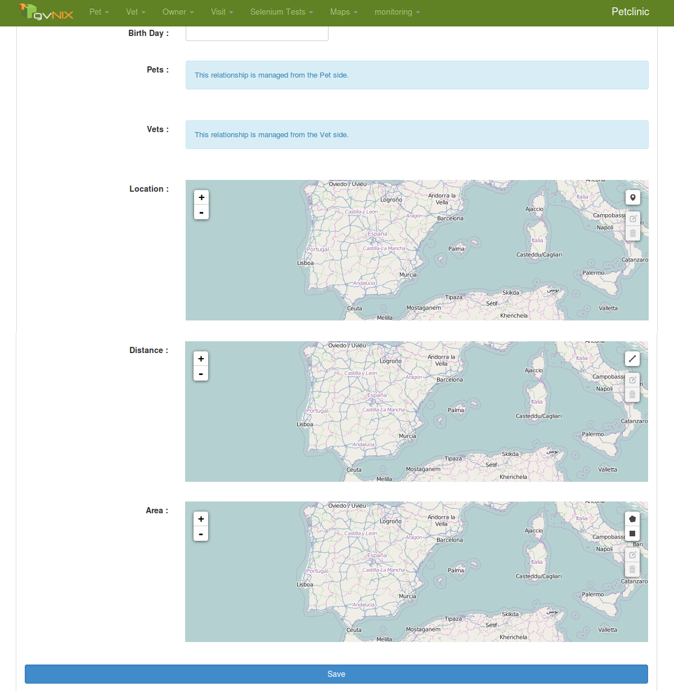 	
 	
Now you can manage easly GEO fields values. 	
 	
NOTE: _If you don't apply this Map Components on CRU views, you need to use http://en.wikipedia.org/wiki/Well-known_text[WKT] on input fields to save valid values_ 	
 	
[generate-map-views] 	
== Generate Map Views 	
 	
You can generate all maps you want on your application. To do that, you need to execute the following commands: 	
 	
[source, shell] 	
web mvc geo controller --class ~.web.MapViewerController --preferredMapping mapview --projection EPSG4326 	
web mvc geo controller --class ~.web.MapController --preferredMapping map 	
 	
Previous commands generate different map views and different entries on top menu. The first map generated is configured with **_EPSG4326_** projection. By default all generated maps are generated with **_EPSG3857_** projection. 	
 	
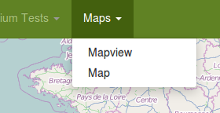 	
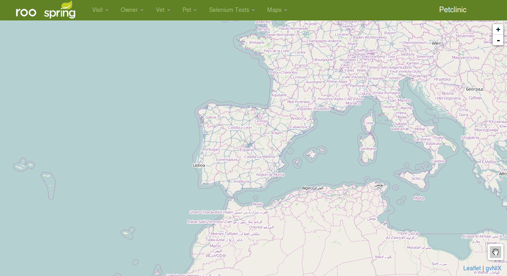 	
 	
NOTE: _If you want to configure map options like zoom, center point, base layer, etc.. you need to edit manually **views/{mappath}/show.jspx** file_ 	
 	
[add-entities-to-map-views] 	
== Add entities to Map Views 	
 	
gvNIX provides you the possibility to display entity data on your map views. 	
 	
On the https://github.com/DISID/gvnix-samples/tree/master/quickstart-geo-app#add-geo-entity-fields[third point] of this guide we added 3 new geo fields on Owner entity. 	
 	
If you want to display all GEO entities on every maps, you need to execute the following commands: 	
 	
[source, shell] 	
web mvc geo entity all 	
 	
However, if you want to add only one geo entity to every map, you need to execute the following command: 	
 	
[source, shell] 	
web mvc geo entity add --controller ~.web.OwnerController 	
 	
NOTE: _If you want to display only one geo entity or all entities in an specific map, you can use **--map** param selecting the map where you want to display them_ 	
 	
Previous commands add to your Map views Owner entity. You can display or hide its fields using checkbox as see on the next images: 	
 	
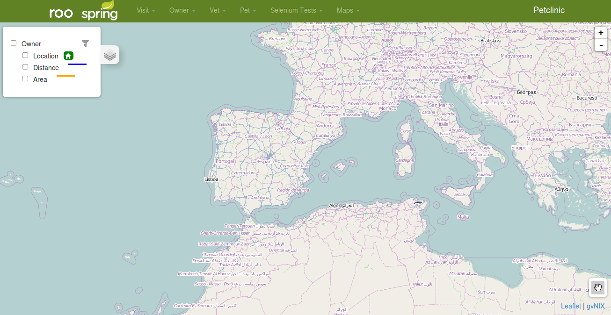 	
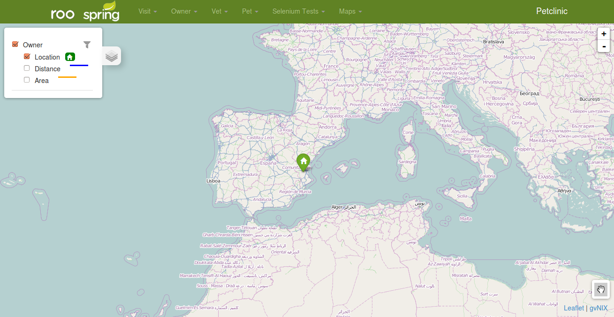 	
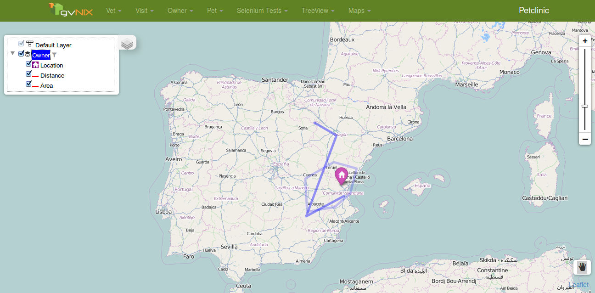 	
 	
 	
[add-base-layers-to-map-views] 	
== Add Base Layers to Map Views 	
 	
gvNIX provides you the possibility to display extra base layers on your map views. 	
 	
Exists more than one type of base layers. At the moment, gvNIX provides you this two types: 	
 	
- http://wiki.openstreetmap.org/wiki/Tiles[TileLayer] 	
- http://wiki.openstreetmap.org/wiki/WMS[WMS Layer] 	
 	
If you want to add Tile Layer on your map views, you need to execute the following command. On this example, you are going to add a Satellit base layer from http://www.ovi.com[OVI]: 	
 	
[source, shell] 	
web mvc geo tilelayer --name satellit --url "http://maptile.maps.svc.ovi.com/maptiler/maptile/newest/satellite.day/{z}/{x}/{y}/256/png8" --index 1 --opacity 0.5 	
 	
 	
If you want to add WMS Layer on your map views, you need to execute the following command. On this example, you are going to add a _geological map of Valencia (Spain)_ from http://www.igme.es/actividadesIGME/lineas/cartoGeo.htm[IGME] 	
 	
[source, shell] 	
web mvc geo wmslayer --name "geological map of valencia" --url "http://mapas.igme.es/gis/services/Cartografia_Geologica/IGME_GeologicoCValenciana_400/MapServer/WMSServer" --format "image/png" --transparent true --version "1.1.1" --crs EPSG4326 --layers "0,1,2,3" 	
 	
NOTE: _When you add new WMS layer, you need to get it using the same projection than your current map views. If you don't do like this, you can see your wms layer on invalid map position._ 	
 	
NOTE: _If you add **--map** command option, you are going to add the new base layer only on the selected map instead of every map_ 	
 	
 	
[add-tools-to-map-views] 	
== Add Tools to Map Views 	
 	
By default, _as you can see on the previous images_, when you generate new map view appears a **toolbar** on bottom right position. This toolbar contains a basic **Hand Tool** that indicates that you can move the map view. 	
 	
At the moment, you can add two tool types using gvNIX commands: 	
 	
- **Measure Tool**: Get distances between some points. 	
- **Custom Tool**: Customize it to generate new custom tools with custom functionalities on your map view. 	
 	
If you want to add new measure tool on your map views you need to execute the next simple command: 	
 	
[source, shell] 	
web mvc geo tool measure --name measure 	
 	
If you want to add new custom tool on your map views you need to execute the following command: 	
 	
[source, shell] 	
web mvc geo tool custom --name latlng --icon fa-location-arrow --activateFunction activateLatLngTool --deactivateFunction deactivateLatLngTool --iconLibrary fa 	
 	
At now, we added new custom tool on toolbar but without any functionality. This tool will gets you the Latitude and Longitude from selected Point. 	
 	
To add custom functionality you need to implement **activateFunction** and **deactivateFunction** like the following: 	
 	
[source, javascript] 	
function activateLatLngTool(element, instance, map){ 	
 map.on("click", function(e){ 	
 alert(e.latlng); 	
 }); 	
} 	
function deactivateLatLngTool(element, instance, map){ 	
 map.off("click"); 	
} 	
 	
When you finish this steps you're going to have the following toolbar: 	
 	
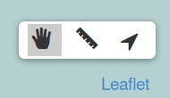 	
 	
 	
NOTE: _If you add **--map** command option, you are going to add the new tool only on the selected map instead of every map_ 	
 	
[advanced-functionalities] 	
== Advanced Functionalities 	
 	
At this moment you have a complete gvNIX GEO application. But... _Which posibilities I have with this GEO application?_ 	
 	
Here there's some functionalities that you can implement/modify on your generated map view. 	
 	
[filtering-map-data-using-datatables] 	
=== Filtering Map Data using Datatables 	
 	
By default, all entities that you add to Map View are filterable. You can identify a filterable entity by the filter icon that appears on layers panel (http://en.wikipedia.org/wiki/Table_of_contents[_TOC_]) 	
 	
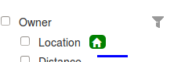 	
 	
With this functionality, you can filter your entity map data using his Datatable. Here's an example: 	
 	
At first, you are displaying all your _Owner_ records on map. 	
 	
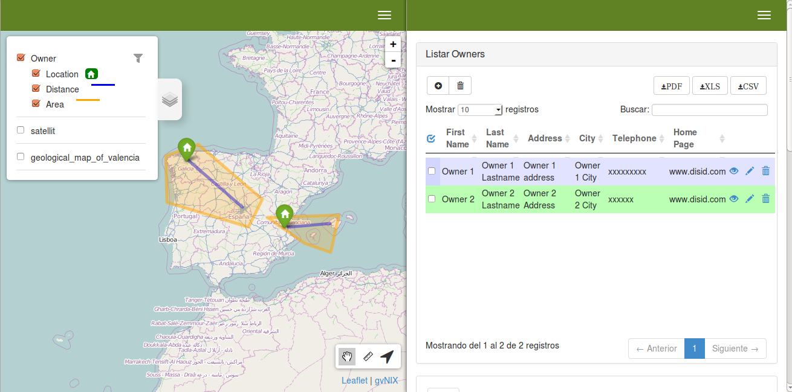 	
 	
If you filter Datatable, you are going to show only filtered records and filter icon change as selected. 	
 	
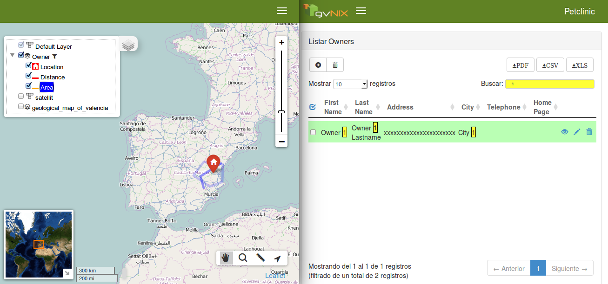 	
 	
If you filter Datatable with other value, you are going to show different filtered records and filter icon change as selected. 	
 	
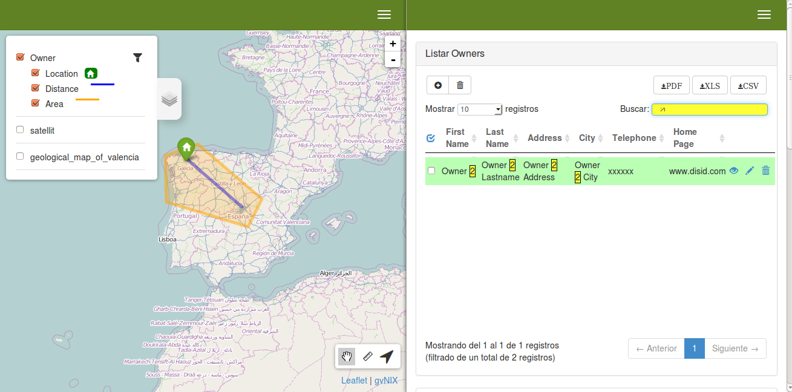 	
 	
NOTE: _You can change filter type of an entity modifying **filterType** attribute on **src/main/webapp/WEB-INF/views/{mappath}/show.jspx**. If you set to **auto**, when you filter datatable, Map data is going to reload automatically. If you set to **manual**, you need to refresh Map View page to display filtered data. If you set to **none** filter button disappear and get all entity records without filter._ 	
 	
[select-map-data-using-datatables] 	
=== Select Map Data using Datatables 	
 	
Another functionality added by default on map entities is selection. 	
 	
With this functionality you can select some records (_is possible to select more than one_) from Datatables and "mark as selected" on your map views as you can see on the following image: 	
 	
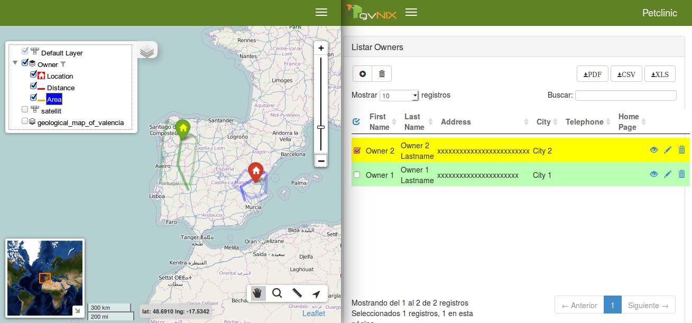 	
 	
This functionality is compatible with Filter Map Data, you can filter your map data using Datatables and then select some record. 	
 	
NOTE: _You can modify selection style editing entity-field **selection attributes** on **src/main/webapp/WEB-INF/views/{mappath}/show.jspx**_ 	
 	
 	
[group-map-markers] 	
=== Group Map Markers 	
 	
If you have some close markers when you change zoom, gvNIX is going to **group** them to improve map navigation as you can see on the following image: 	
 	
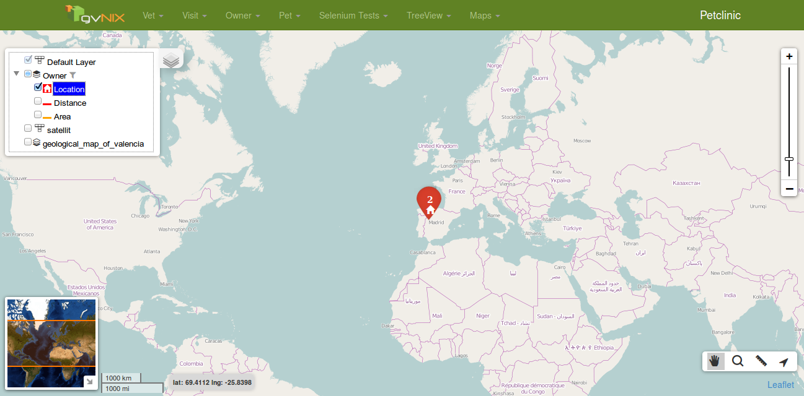 	
 	
If you click on **grouped marker** map will zoom on markers area to view all markers without group. 	

== Related libraries, projects, etc..

gvNIX is based on https://github.com/spring-projects/spring-roo[Spring Roo] project. 

To implement GEO functionalities gvNIX uses http://www.leafletjs.com[Leaflet project] and different Leaflet Plugins like:

- https://github.com/mapbox/leaflet-omnivore[Leaflet Omnivore]
- https://github.com/Leaflet/Leaflet.draw[Leaflet Draw Plugin]
- ...

